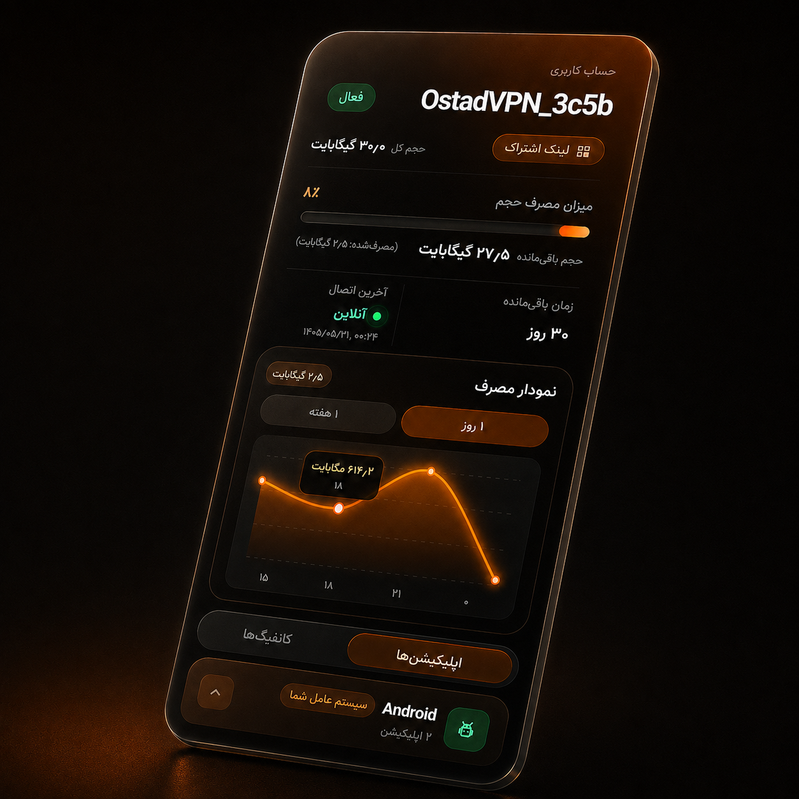

<div align="center">
  
</div>

<h1 align="center">PGClock AMOLED</h1>

<p align="center">
  قالب صفحه اشتراک Pasarguard با پس‌زمینه مشکی عمیق و رنگ تأکیدی نارنجی
</p>

---

## ویژگی‌ها

- طراحی بهینه‌شده برای نمایشگرهای AMOLED
- پس‌زمینه مشکی خالص و کارت‌های شیشه‌ای تیره
- نمایش اطلاعات اشتراک، هشدارها و نمودار مصرف روزانه، هفتگی و ماهانه
- نمودار روزانه ۲۴ ساعته با تاریخ و ساعت شمسی هر نقطه و محور حجم داینامیک متناسب با مصرف هر کاربر
- کپی لینک، نمایش QR و دانلود کانفیگ WireGuard
- تشخیص سیستم‌عامل و نمایش اپلیکیشن‌های مناسب
- داشبورد واکنش‌گرا؛ نمایش حساب و نمودار کنار هم و بلوک‌های مستقل اپلیکیشن‌ها و کانفیگ‌ها در دسکتاپ
- استفاده از کل فضای پنجره ویندوز بدون اسکرول صفحه (اسکرول داخلی فقط برای فهرست‌های بسیار بلند)
- یک فایل HTML و بدون نیاز به Node.js یا Build

---

## نصب و به‌روزرسانی

روی سروری که Pasarguard نصب شده است، دستور زیر را اجرا کنید:

```bash
sudo wget -N -O /var/lib/pasarguard/templates/subscription/index.html \
  https://raw.githubusercontent.com/localhoct/PGClock/main/index.html
```

با اجرای دوباره همین دستور، فایل قالب از مخزن `localhoct/PGClock` دریافت می‌شود.

---

## تنظیم Pasarguard

فایل زیر را باز کنید:

```bash
sudo nano /opt/pasarguard/.env
```

این مقادیر باید در فایل تنظیمات وجود داشته باشند:

```env
CUSTOM_TEMPLATES_DIRECTORY="/var/lib/pasarguard/templates/"
SUBSCRIPTION_PAGE_TEMPLATE="subscription/index.html"
```

سپس سرویس را راه‌اندازی مجدد کنید:

```bash
sudo pasarguard restart
```

---

## تنظیمات پنل

1. وارد **Settings → Subscription** در پنل Pasarguard شوید.
2. متن اعلان و لینک اعلان را تنظیم کنید.
3. اپلیکیشن‌های موردنیاز را در بخش Apps اضافه یا ویرایش کنید.

---

## پروژه اصلی

این مخزن نسخه شخصی‌سازی‌شده‌ای از [Mrclocks/PGClock](https://github.com/Mrclocks/PGClock) است.
